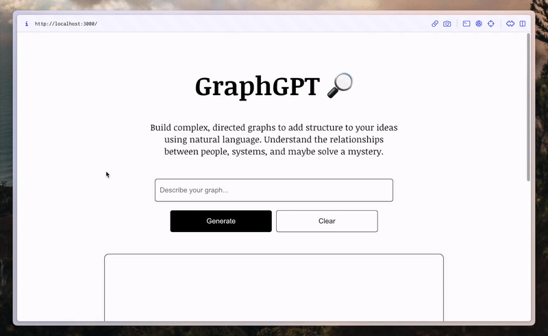

# GraphGPT
### Natural Language → Knowledge Graph

GraphGPT converts unstructured natural language into a knowledge graph. Pass in the synopsis of your favorite movie, a passage from a confusing Wikipedia page, or transcript from a video to generate a graph visualization of entities and their relationships. 

Successive queries can update the existing state of the graph or create an entirely new structure. For example, updating the current state could involve injecting new information through nodes and edges or changing the color of certain nodes.

The current few-shot prompt guides GPT-3 in accurately understanding the JSON formatting GraphGPT requires for proper rendering. You can see the entire prompt in `public/prompts/main.prompt`. A major issue at the moment is latency. Due to the nature of OpenAI API calls, it takes up to 20 seconds to receive a response.

## Setup

1. Run `npm install` to download required dependencies (currently just [react-graph-vis](https://github.com/crubier/react-graph-vis)).
2. CREATE `src/OPENAI_API_KEY.js` using template in `src/OPENAI_API_KEY.template.js`.
3. Run `npm run start`. GraphGPT should open up in a new browser tab.
